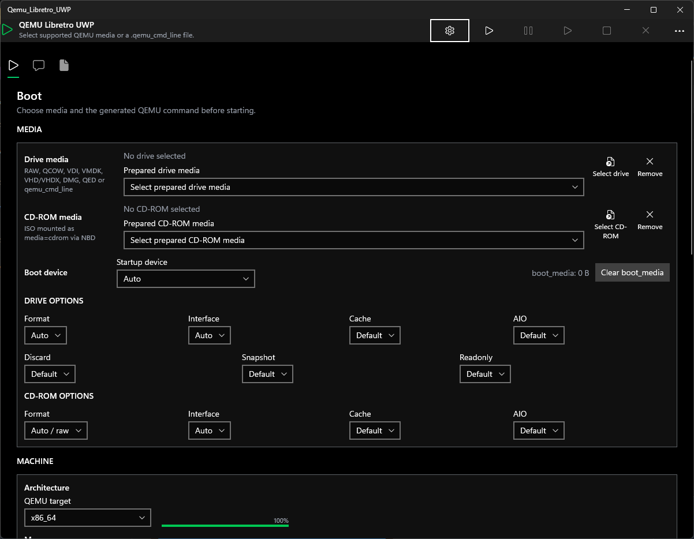
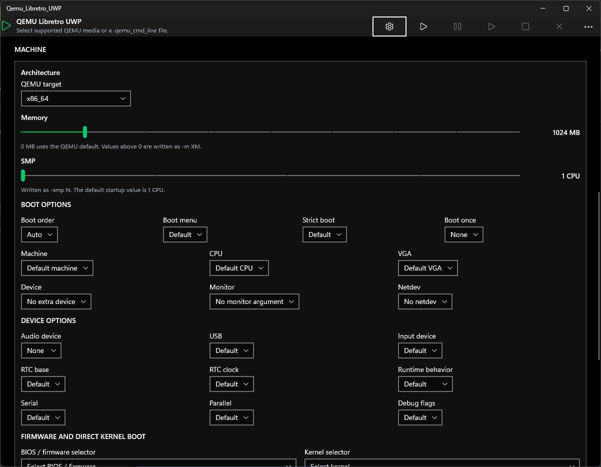
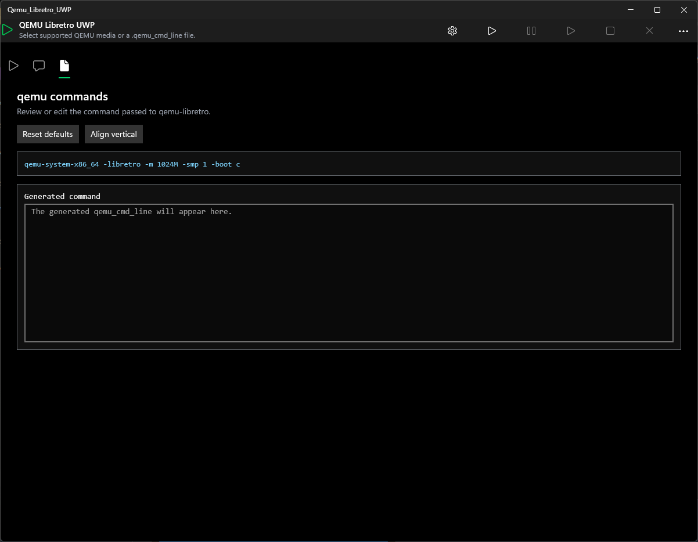

# Qemu-Libretro-UWP

Qemu-Libretro-UWP is an experimental UWP front end and DirectX libretro host for
running `qemu_libretro.dll`. The app builds QEMU command lines from selectable
boot profiles, media, machine, CPU, device, VGA, monitor, netdev, firmware, and
direct kernel boot controls, then starts the packaged QEMU libretro core.

The app is designed around UWP app-container restrictions. Selected disk and
CD-ROM media are copied into `boot_media` and served to QEMU through a local NBD
endpoint, avoiding QEMU's unreliable Win32 file-backed block device access in
UWP. The generated command can be reviewed and edited before startup.

## Screenshots

<p>
  
  
  
</p>

## Current Status

Working:

- Loading `qemu_libretro.dll` from the app package.
- Registering libretro callbacks for video, audio, input, environment, and logs.
- Rendering libretro video frames through DirectX.
- Running QEMU machine-only/video-test configurations.
- Booting ISO images as read-only CD-ROM media through local NBD.
- Booting supported QEMU disk image formats through local NBD with write
  support when the staged copy can be opened read-write.
- Selecting previously staged Drive media and CD-ROM media from `boot_media`.
- Clearing `boot_media` and showing its current size in the Media tab.
- Selecting firmware and direct kernel boot files from packaged `qemu` files or
  staged `boot_media` files.
- Populating target-specific machine, CPU, device, VGA, monitor, and netdev
  selectors from the selected QEMU target and caching probed results.
- Showing boot, media, machine, errors, and generated QEMU commands in tabs.
- Collapsing the configuration tabs when the emulator starts.
- Writing diagnostic logs to the app `LocalState` folder.
- Serving selected boot media through a local NBD server so QEMU can access
  media without using its broken Win32 file backend.

Known limitation:

- QEMU commands that use a local real file-backed block device, such as
  `-cdrom`, `-drive file=C:/...`, or `-blockdev driver=file`, currently hang
  inside the first `retro_run` call. The app avoids this by exposing media as
  `nbd://127.0.0.1:<port>` and passing that URL to QEMU's NBD block driver.
- Pause, Resume, Stop, and Shutdown command-bar buttons are currently present
  but disabled while the QEMU/libretro lifecycle is being kept conservative.

## Repository Layout

- `DirectXPage.xaml` - Main UWP interface.
- `DirectXPage.xaml.cpp` - UI behavior, command generation, boot media staging,
  local NBD media server, and app log writing.
- `LibretroHost.*` - Native libretro host, callbacks, frame storage, logging,
  and run loop.
- `LibretroCore.*` - Dynamic loading wrapper for `qemu_libretro.dll`.
- `Qemu_Libretro_UWPMain.*` - DirectX render loop integration.
- `Content/LibretroFrameRenderer.*` - Uploads libretro frames to DirectX.
- `Package.appxmanifest` - UWP package manifest.

The Visual Studio project packages local runtime files from this project
directory:

- `qemu_libretro.dll`
- `qemu\**\*`

Make sure `qemu_libretro.dll` is available next to
`Qemu-Libretro-UWP.vcxproj` before building or running the app.
For GitHub distribution, the DLL may be stored as `qemu_libretro-dll.rar`.
Extract that archive into the project directory so `qemu_libretro.dll` exists
next to `Qemu-Libretro-UWP.vcxproj` before building.

## Requirements

- Windows with UWP support.
- Visual Studio 18 Community or compatible MSBuild installation.
- Windows 10 SDK App Certification Kit for `signtool.exe`.
- A signing certificate, for example:

```text
C:\Certificates\UWP-Port_TemporaryKey.pfx
```

## Build

Example using Command Prompt:

```cmd
set "PROJECT_DIR=C:\Projects\Qemu-Libretro-UWP"
set "MSBUILD=C:\Program Files\Microsoft Visual Studio\18\Community\MSBuild\Current\Bin\MSBuild.exe"

"%MSBUILD%" "%PROJECT_DIR%\Qemu-Libretro-UWP.vcxproj" /p:Configuration=Debug /p:Platform=x64 /m /nr:false /v:minimal
```

The generated package is written under:

```text
Qemu-Libretro-UWP\AppPackages\Qemu-Libretro-UWP\Qemu-Libretro-UWP_<version>_Debug_Test\
```

## Sign And Verify

Example using Command Prompt:

```cmd
set "PROJECT_DIR=C:\Projects\Qemu-Libretro-UWP"
set "SIGNTOOL=C:\Program Files (x86)\Windows Kits\10\App Certification Kit\signtool.exe"
set "PFX=C:\Certificates\UWP-Port_TemporaryKey.pfx"
set "MSIX=%PROJECT_DIR%\AppPackages\Qemu-Libretro-UWP\Qemu-Libretro-UWP_<version>_Debug_Test\Qemu-Libretro-UWP_<version>_x64_Debug.msix"

"%SIGNTOOL%" sign /fd SHA256 /f "%PFX%" "%MSIX%"
"%SIGNTOOL%" verify /pa "%MSIX%"
```

## Usage

1. Install the signed MSIX package.
2. Open the app.
3. Select the QEMU target and profile.
4. Use Media to select or stage Drive media and CD-ROM media, or choose already
   staged files from `boot_media`.
5. Use Machine and Firmware/Direct Kernel Boot controls as needed.
6. Review the generated command in the `qemu commands` tab.
7. Press Start from the top command bar.

The available diagnostic profiles are:

- `Normal command` - Main boot path. The app serves selected media over a local
  NBD endpoint and passes that endpoint to QEMU as the boot disk/CD.
  ISO files are exposed read-only as CD-ROM when the CD-ROM option is enabled.
  Disk images are exposed as writable disks when possible.
- `Video Teste` - Starts QEMU without media to verify emulator video output.
- `Linux cloud qcow2`, `Ubuntu 10`, `Ubuntu 14`, `Windows 98`, `Windows XP`,
  and `Windows 7` - Apply target, memory, machine, CPU, video, network, and
  boot defaults when the selected options are available in the packaged core.

Generated format mapping:

- `.iso` as CD-ROM: `format=raw,media=cdrom,readonly=on`
- `.img` / `.raw`: `format=raw,media=disk`
- `.qcow`: `format=qcow,media=disk`
- `.qcow2`: `format=qcow2,media=disk`
- `.qed`: `format=qed,media=disk`
- `.vdi`: `format=vdi,media=disk`
- `.vmdk`: `format=vmdk,media=disk`
- `.vhd` / `.vpc`: `format=vpc,media=disk`
- `.vhdx`: `format=vhdx,media=disk`
- `.bochs`: `format=bochs,media=disk`
- `.cloop`: `format=cloop,media=disk`
- `.dmg`: `format=dmg,media=disk`
- `.hds` / `.parallels`: `format=parallels,media=disk`

The mapping follows the block format drivers present in `qemu-libretro-src`.
Multi-file formats such as some VMDK layouts still need their companion extent
files to be available to QEMU; single-file images are the reliable path.

## Supported QEMU Targets

The app uses the packaged `qemu_libretro.dll` to expose these libretro
architecture targets:

```text
aarch64, alpha, arm, i386, m68k, mips, mips64, mips64el, mipsel, ppc,
ppc64, riscv32, riscv64, s390x, sparc, sparc64, x86_64
```

These targets are available in the QEMU target selector. Machine, CPU, device,
VGA, monitor, and netdev options are populated for the selected target and kept
in cache after the first probe for that target.

## Logs

Logs are written to the app `LocalState` folder:

- `qemu-uwp.log` - UI-side startup and command generation log.
- `qemu-uwp-native.log` - Native host, libretro callbacks, video frame, and
  run-loop diagnostics.
- `qemu-uwp-stderr.log` - Redirected stdout/stderr from the native core.

Typical useful lines:

```text
Start: local read-only NBD server started at nbd://127.0.0.1:10809
Start: qemu_cmd_line: ...
Host: qemu_libretro.dll loaded and exports resolved.
Host: calling first retro_run.
Host: video frame received ...
```

If a command using `file=` hangs, the log usually stops after:

```text
Host: calling first retro_run.
Host: watchdog: first retro_run has not returned after 3s.
```

## References

- [io12/qemu-libretro](https://github.com/io12/qemu-libretro)
- [rodrigoandrigo/Bochs-UWP](https://github.com/rodrigoandrigo/Bochs-UWP)
